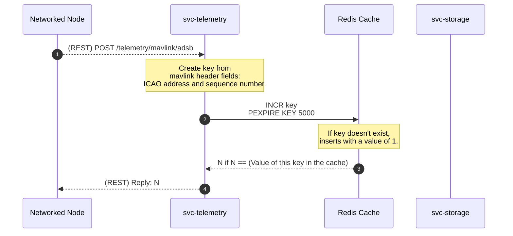

# Software Design Document (SDD) - `svc-telemetry` 

## Overview

This document details the software implementation of the Arrow telemetry service.

This service aggregates telemetry transmitted by networked assets (e.g. aircraft, drones, mobile vertiports, etc.) and rebroadcasts to listeners.

It implements a cache to filter out duplicate telemetry reports, such as an aircraft ADS-B message received by multiple networked towers within range.

Attribute | Description
--- | ---
Status | Development
Stuckee | A.M. Smith ([@ServiceDog](https://github.com/ServiceDog))

## Related Documents

Document | Description
--- | ---
[High-Level Concept of Operations (CONOPS)](https://github.com/Arrow-air/se-services/blob/develop/docs/conops.md) | Overview of Arrow microservices.
[High-Level Interface Control Document (ICD)](https://github.com/Arrow-air/se-services/blob/develop/docs/icd.md)  | Interfaces and frameworks common to all Arrow microservices.
[Requirements - `svc-telemetry`](https://nocodb.arrowair.com/dashboard/#/base/c436b0fb-9d80-4465-880c-860ce8300839) | Requirements and user stories for this microservice.
[Concept of Operations - `svc-telemetry`](./conops.md) | Defines the motivation and duties of this microservice.
[Interface Control Document (ICD) - `svc-telemetry`](./icd.md) | Defines the inputs and outputs of this microservice.

## Module Attributes

Attribute | Applies | Explanation
--- | --- | ---
Safety Critical | Y | Live telemetry instrumental to safe operations, especially for autonomous vehicles.
Real-Time | Y | Telemetry broadcasts should be as close to realtime as possible, for safety concerns.

## Logic

### Initialization

At initialization this service creates two servers on separate threads: a GRPC server and a REST server.

The REST server expects the following environment variables to be set:
- `DOCKER_PORT_REST` (default: `8000`)

The GRPC server expects the following environment variables to be set:
- `DOCKER_PORT_GRPC` (default: `50051`)

### Control Loop

As a REST and GRPC server, this service awaits requests and executes handlers.

Some handlers **require** the following environment variables to be set:
- `STORAGE_HOST_GRPC`
- `STORAGE_PORT_GRPC`

This information allows this service to connect to other microservices to obtain information requested by the client.

:exclamation: These environment variables will *not* default to anything if not found. In this case, requests involving the handler will result in a `503 SERVICE UNAVAILABLE`.

For detailed sequence diagrams regarding request handlers, see [REST Handlers](#rest-handlers).

## REST Handlers

### `mavlink_adsb` Handler

The client will attempt to post a packet conforming to [Mavlink protocol](https://mavlink.io/en/guide/serialization.html) with an [ADS-B message payload](https://mavlink.io/en/messages/common.html#ADSB_VEHICLE).

**(mavlink_adsb) Nominal**

**(mavlink_adsb) Off-Nominal**: Invalid packet

Invalid request packets will return `400 BAD REQUEST`.

**(mavlink_adsb) Off-Nominal**: Redis Cache Error

If there was an issue updating the Redis cache, the server will reply an opaque `500 INTERNAL_SERVER_ERROR`.
